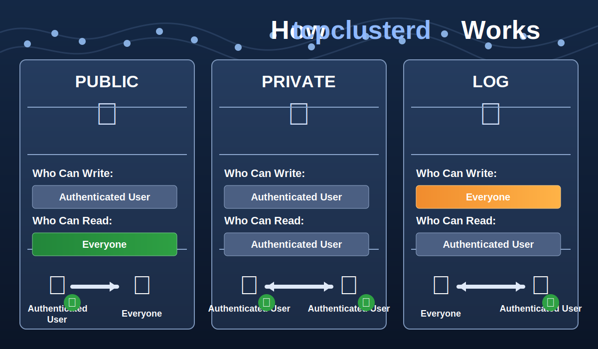

# tcpclusterd

En distribuert database- og synkroniseringstjeneste med tre datamodeller i samme system:

- `PUBLIC`: autentisert skriving, offentlig lesing
- `PRIVATE`: autentisert skriving, autentisert lesing
- `LOG`: offentlig skriving, autentisert lesing

Dette er den kanoniske dokumentasjonen for `tcpclusterd`. Resten av dokumentasjonen under `md/` er sekundar eller historisk.



## Hva tcpclusterd er

`tcpclusterd` kombinerer fire ting i ett program:

1. En enkel database med offentlige og private tabeller.
2. En loggmodell for append-only hendelser (`LOG`).
3. Flere transportlag for klienter: lokal unix socket, TCP og HTTP.
4. Klyngereplikering og runtime-snapshots for drift over flere noder.

Tanken er at samme datasett kan eksponeres med ulike synlighetsnivåer uten å bygge et separat auth-lag for hver brukssak.

Typiske brukssaker:

- status- og tilgjengelighetsdata som skal vises offentlig
- kundedata eller interne tabeller som kun skal leses av autentiserte brukere
- audit, eventer og innsendte logger som alle skal kunne skrive til, men ikke lese fritt

## Tilgangsmodell

| Modell | Hvem kan skrive | Hvem kan lese | Typisk bruk |
| --- | --- | --- | --- |
| `PUBLIC` | Autentisert bruker | Alle | offentlige profiler, statussider, katalogdata |
| `PRIVATE` | Autentisert bruker | Autentisert bruker med tilgang | interne tabeller, kunde- og admin-data |
| `LOG` | Alle | Autentisert bruker | audit, event streams, innkommende hendelser |

Viktige nyanser:

- `PUBLIC` betyr ikke anonym skriving. Offentlige tabeller kan leses uten auth, men skriving krever identitet.
- `PRIVATE` følger databasescope. Admin har global tilgang, andre brukere har normalt tilgang til sin egen database.
- `LOG` er designet for append-only bruk. Skriving kan være offentlig, men lesing krever auth.
- `SELECT LOG COUNT(*)` kan brukes offentlig som et kontrollert unntak når bare antall skal eksponeres.

## Slik fungerer systemet

### 1. Oppstart

Når du starter `./app`, skjer dette grovt sett:

1. Konfigurasjon leses fra miljøvariabler.
2. Siste runtime lastes eller opprettes.
3. Systemdatabase og metadata initialiseres.
4. Lokal unix socket startes alltid på `/tmp/tcpclusterd.sock`.
5. HTTP, TCP og WebSocket starter bare hvis de er konfigurert i `system.services_config`.
6. Snapshot-lagring, WAL og eventuelle cluster-rutiner går videre i bakgrunnen.

Som standard starter altså serveren i `socket-only` modus.

### 2. Lagringsmodell

`tcpclusterd` lagrer runtime-data i runtime-kataloger, typisk under `runtime/<timestamp>/`.

Praktisk betyr det:

- systemtilstand og runtime-data snapshots lagres på disk
- loggdata for `LOG` skrives som `jsonl`
- noder kan laste lokal runtime, siste runtime eller runtime fra cluster
- senere reconnects kan bruke WAL i stedet for full sync

### 3. Servicekonfigurasjon

Transportlagene er dynamiske og leses fra databasen, ikke hardkodet ved oppstart:

- `http`
- `tcp`
- `websocket`

Det gjør at du kan starte i lokal socket-modus, og deretter aktivere nettverkstjenester via CLI eller socket uten restart i mange tilfeller.

### 4. Felles kommandomodell

Det finnes to hovedmåter å snakke med `tcpclusterd` på:

- SQL-lignende kommandoer, som `SELECT`, `INSERT`, `UPDATE`, `DELETE`, `UPSERT`
- socket-/TCP-kommandoer som `auth`, `query`, `export`, `subscribe`, `listusers`

Lokal unix socket og TCP bruker nå samme linjebaserte kommandoformat. Forskjellen er auth:

- unix socket: alltid aktiv, alltid uautentisert, behandles som lokal admin-kontekst
- TCP: krever `auth` og token for beskyttede operasjoner

### 5. Replikering

Ved cluster-oppsett replikeres writes mellom noder.

Kortversjonen:

- full sync brukes typisk når en node starter tom
- WAL brukes for reconnect og løpende catching-up
- runtime snapshots og journaling brukes for å sikre konsistent tilstand
- `LOG`-writes replikeres også som journalførte operasjoner

## Rask start

### Bygg

```bash
cd /path/to/tcpclusterd
go build -o app
```

### Minste nødvendige miljøvariabler

```bash
ADMIN_PASSWORD="ditt-sikre-passord"
AES_KEY="32-tegns-krypteringsnøkkel-her"
CLUSTER_PEERS=""
REPLICATION_TOKEN="hemmelig-replikeringstoken"
TOKEN_EXPIRATION="3600"
MAX_TOKENS_PER_USER="10"

# Offentlig LOG rate limiting
LOG_PUBLIC_RATE_LIMIT_WINDOW_MS="60000"
LOG_PUBLIC_RATE_LIMIT_MAX_REQUESTS="120"

# LOG størrelse/segmentering
LOG_MAX_ROW_BYTES="65536"
LOG_MAX_FILE_BYTES="67108864"
```

### Start serveren

```bash
./app
```

Etter oppstart har du alltid lokal socket på:

```text
/tmp/tcpclusterd.sock
```

## Transportlag

### Lokal unix socket

Dette er standard og alltid tilgjengelig.

Egenskaper:

- krever ikke autentisering
- brukes av `./app`-CLI
- støtter samme kommandoformat som TCP-klienter
- er ment for lokal maskin og root-/admin-lignende driftstilgang

JSON-eksempel:

```bash
printf '{"command":"query","data":{"query":"SELECT * FROM system.users"}}\n' | nc -U /tmp/tcpclusterd.sock
```

Tekstbasert eksempel:

```bash
printf 'SELECT * FROM system.users\n' | nc -U /tmp/tcpclusterd.sock
```

Hvis en klient sender `auth` over unix socket, returneres bare en kompatibilitetsrespons som sier at auth ikke trengs lokalt.

### TCP

TCP må eksplisitt aktiveres:

```bash
./app --config-tcp "enabled=true port=5000 host=0.0.0.0"
```

TCP bruker samme requestmodell som lokal socket, men med autentisering.

En enkel flyt over TCP er:

1. send `auth`
2. hent token fra svaret
3. send `query`, `export`, `subscribe` osv. med token

Eksempel med JSON-linjer:

```text
{"command":"auth","data":{"username":"admin","password":"secret"}}
{"command":"query","data":{"token":"...","query":"SELECT * FROM admin.orders"}}
```

### HTTP API

HTTP må også aktiveres eksplisitt:

```bash
./app --config-http "enabled=true port=9090 host=0.0.0.0"
```

De viktigste endepunktene er:

- `POST /api/auth`
- `POST /api/query`
- `POST /api/execute`
- `GET /health`

Eksempel: hent token

```bash
TOKEN=$(curl -s -X POST http://localhost:9090/api/auth \
  -H "Content-Type: application/json" \
  -d '{"username":"admin","password":"secret"}' | jq -r '.token')
```

Eksempel: kjør query

```bash
curl -X POST http://localhost:9090/api/query \
  -H "Content-Type: application/json" \
  -H "Authorization: Bearer $TOKEN" \
  -d '{"query":"SELECT * FROM admin.orders"}'
```

### WebSocket

WebSocket er tilgjengelig som tjenestetype i konfigurasjonen, men den viktigste driftsmodellen i dette repoet er fortsatt lokal socket, TCP og HTTP.

## Konfigurering av tjenester

Serveren starter i praksis i `socket-only` modus. Aktiver transportene du trenger.

### HTTP

```bash
./app --config-http "enabled=true port=9090 host=0.0.0.0"
```

### TCP

```bash
./app --config-tcp "enabled=true port=5000 host=0.0.0.0"
```

### WebSocket

```bash
./app --config-ws "enabled=true port=8080 host=0.0.0.0"
```

### API CORS

```bash
./app --config-cors "allow_all_origins=false allowed_origins=https://app.example.com allowed_methods=GET,POST,OPTIONS allowed_headers=Authorization,Content-Type allow_credentials=true max_age_seconds=900"
```

### Sjekk service status

```bash
./app --list-services
./app --list-cors
```

## CLI-eksempler

CLI-en kommuniserer via lokal unix socket.

### Brukeradministrasjon

```bash
./app --add brukernavn --password passord123
./app --listusers
./app --remove brukernavn
./app --invalidate brukernavn
./app --flushtokens
```

### Data og eksport

```bash
./app --export
./app --export mindb
./app --import data.json
./app --import data.json --clear
./app --importpersistent
```

### Runtime og cluster

```bash
./app --lastruntime
./app --exportlastruntime
./app --load runtime
./app --load cluster
./app --load cluster --force
./app --auto
./app --flushwal
./app --list-cluster
./app --peer-metrics
```

## SQL-modellen

### PUBLIC

Offentlige tabeller er lesbare uten autentisering, men skrivbare bare for autentiserte brukere.

Eksempel:

```sql
INSERT PUBLIC INTO website.agents (agent_id, name, status) VALUES ('agent_001', 'John', 'online')
SELECT * FROM website.agents WHERE status = 'online'
```

Bruk dette for data som skal eksponeres offentlig, som kataloger, statuser og UI-data.

### PRIVATE

Private tabeller krever autentisering og riktig tilgang.

Eksempel:

```sql
INSERT PRIVATE INTO admin.credentials (agent_id, phone) VALUES ('agent_001', '+47-555-1234')
SELECT PRIVATE * FROM admin.credentials WHERE agent_id = 'agent_001'
```

Bruk dette for kundedata, interne oppslag og admin-tabeller.

### LOG

`LOG` er append-only og egner seg til hendelser og audit.

Eksempel på offentlig skrivekall:

```sql
INSERT LOG INTO audit.events (event, actor) VALUES ('login', 'admin')
```

Ved `INSERT LOG` går ikke dataen inn i en vanlig in-memory tabell. Den appendes i stedet til disk, normalt som `jsonl` under runtime-katalogen.

Felter som alltid eller typisk legges på:

- `logged_at`
- `source`
- `request_ip`
- `request_user`
- `session_id`

Autentisert lesing av logg:

```sql
SELECT LOG * FROM audit.events WHERE actor = 'admin'
```

Offentlig telling uten å lekke innhold:

```sql
SELECT LOG COUNT(*) FROM audit.events WHERE actor = 'admin'
```

## SQL-støtte

Parseren støtter blant annet:

- `SELECT`
- `INSERT`
- `UPDATE`
- `DELETE`
- `UPSERT`
- `SELECT PRIVATE`
- `SELECT PUBLIC`
- `SELECT LOG`
- `ORDER BY`
- `LIMIT`
- `OFFSET`

`WHERE` støtter sammensatte betingelser med `AND` og `OR`, samt operatorer som:

- `=`
- `!=`
- `<`, `<=`, `>`, `>=`
- `LIKE`
- `IN`, `NOT IN`
- `IS NULL`, `IS NOT NULL`

## Eksempler på ende-til-ende bruk

### Eksempel 1: offentlig statusvisning

Skriv status som autentisert bruker:

```sql
INSERT PUBLIC INTO website.agents (agent_id, name, status) VALUES ('agent_001', 'John', 'online')
```

Les offentlig uten token:

```sql
SELECT * FROM website.agents WHERE status = 'online'
```

### Eksempel 2: intern kundedata

Skriv privat:

```sql
INSERT PRIVATE INTO customers.records (customer_id, email) VALUES ('c_001', 'kunde@example.com')
```

Les privat som admin eller eier:

```sql
SELECT PRIVATE * FROM customers.records WHERE customer_id = 'c_001'
```

### Eksempel 3: offentlig event-innsending

Send audit-/telemetrihendelse uten auth:

```sql
INSERT LOG INTO public_events.clicks (page, button) VALUES ('landing', 'signup')
```

Les senere som autentisert bruker:

```sql
SELECT LOG * FROM public_events.clicks WHERE button = 'signup'
```

## Cluster og runtime

For cluster setter du normalt:

```bash
CLUSTER_PEERS="node1:5000,node2:5000,node3:5000"
REPLICATION_TOKEN="shared_secret"
```

Praktiske regler:

- bruk full sync når en node starter tom
- bruk WAL replay når en node reconnecter uten full reboot
- behold WAL så lenge clusteret trenger catch-up
- `--flushwal` tvinger senere full sync for noder som ligger for langt bak

## Fil- og katalogoversikt

De viktigste delene i repoet er:

```text
tcpclusterd/
├── server.go
├── modules/
├── md/
├── runtime/
├── backups/
├── logs/
└── README.md
```

Spesielt nyttig:

- `server.go`: oppstart, CLI, socket/TCP-kommandoflyt
- `modules/database.go`: datalagring og tilgangsmodell
- `modules/httpserver.go`: HTTP API og auth/regler
- `modules/peer.go` og `modules/replication.go`: cluster- og replikeringslogikk
- `modules/runtime_wal.go`: WAL/runtime-håndtering

## Driftsnotater

- Lokal unix socket er bevisst uautentisert og ment som lokal driftstilgang.
- TCP og HTTP er de riktige transportene for eksterne klienter.
- Hvis du eksponerer HTTP eller TCP offentlig, må du sette sterke secrets og stram nettverkstilgang.
- `LOG`-skriving kan være offentlig, så rate limiting og logggrenser er viktige i produksjon.

## Kort oppsummering

Hvis du bare skal huske fem ting om `tcpclusterd`, så er det disse:

1. Serveren starter alltid med lokal unix socket.
2. HTTP og TCP må aktiveres eksplisitt.
3. `PUBLIC` kan leses av alle, men ikke skrives av alle.
4. `PRIVATE` krever auth og riktig databasescope.
5. `LOG` er append-only, offentlig skrivbar og egnet til audit/eventer.
*** Add File: /Users/vidartessem/Documents/VSC/tcpclusterd/md/INDEX.md
# Dokumentasjonsindeks

Den gjeldende, komplette dokumentasjonen for `tcpclusterd` ligger i repo-roten:

- `README.md`

`README.md` dekker nå:

- hvordan `tcpclusterd` fungerer
- tilgangsmodell for `PUBLIC`, `PRIVATE` og `LOG`
- transportlag: unix socket, TCP og HTTP
- autentisering og lokale socket-regler
- CLI, SQL og API-eksempler
- runtime, snapshots og cluster

Resten av filene under `md/` er sekundare eller historiske referanser.
*** End Patch